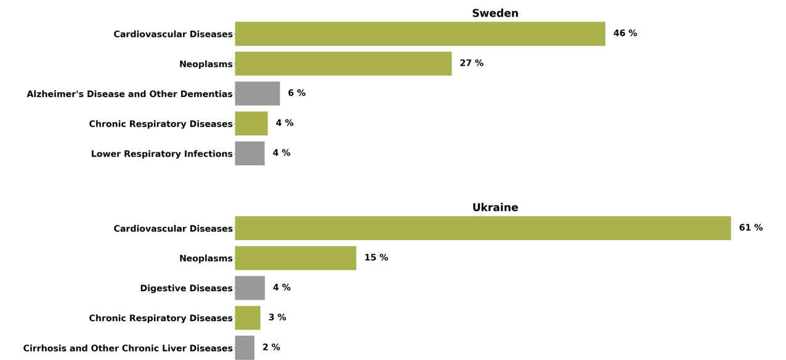
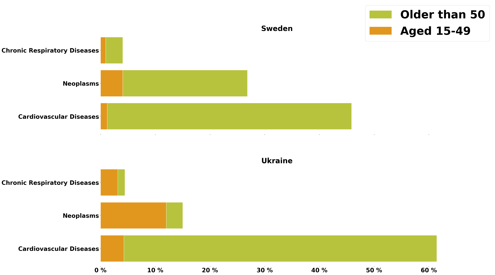
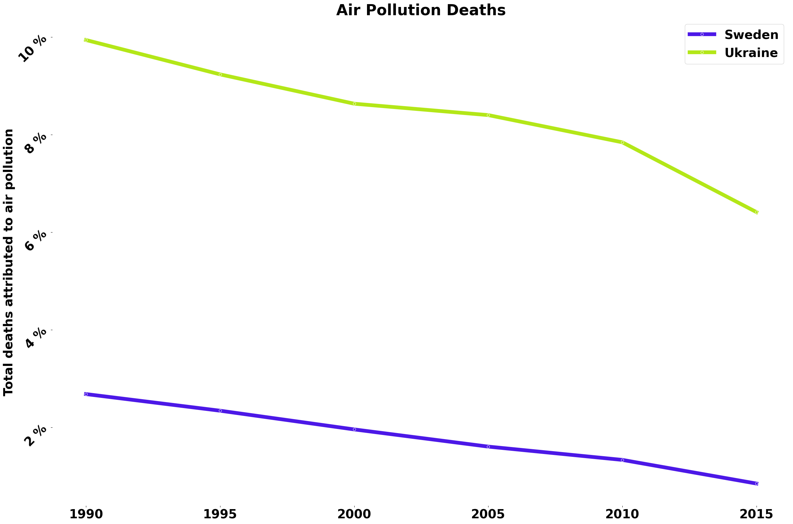
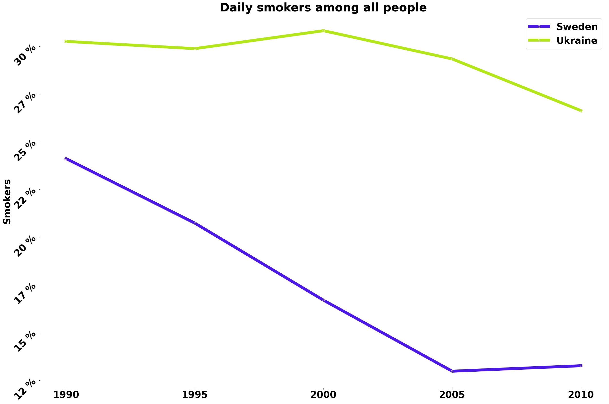
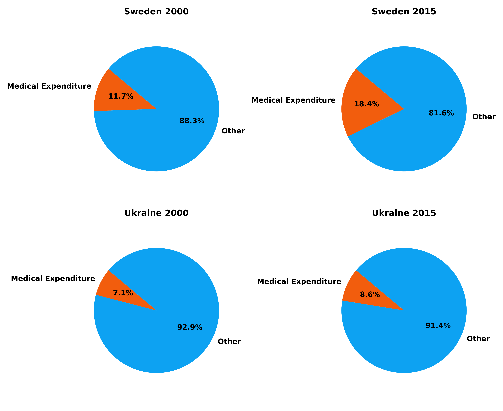

# Analysis of Causes of Death in Sweden and Ukraine

## Description

This project focuses on analyzing and comparing the causes of death in Sweden and Ukraine. The main goal is to visualize the data and create insightful graphs that highlight the influencing factors.

## Data Source
The dataset is taken from the UCI repository Burden Diseases:
[https://ourworldindata.org/burden-of-disease](https://ourworldindata.org/burden-of-disease)

## Project Highlights

After data cleaning and Exploratory Data Analysis (EDA), I conducted a detailed analysis and created graphs that reveal key insights from the data.

## Features

- **Data Cleaning**: Ensuring the data is accurate and ready for analysis.
- **EDA**: Conducting exploratory data analysis to understand the data better.
- **Data Visualization**: Creating graphs and charts to visualize the insights.
- **Comparison**: Highlighting differences and similarities in the causes of death between Sweden and Ukraine.

## Data Visualization

First, let's look at the top 5 diseases causing deaths in Ukraine and Sweden, and highlight the common diseases between the countries.

Now let's have a look at the top 3 diseases for each country and the age groups of people who died from each disease.

Why does Ukraine have four times more deaths from chronic respiratory diseases? I researched the causes of this disease and found the main factors to be:
Smoking, air pollution, diet, alcohol.
Let's first look at the statistics for these two factors in these countries. 

Air pollution:

Number of smokers:

And finally, let's compare the percentage of GDP spent on medical expenditure.

## Conclusion

Having understood the reasons and compared the results of the two countries, it is now clearer why Ukraine has more deaths from chronic respiratory diseases than Sweden.
